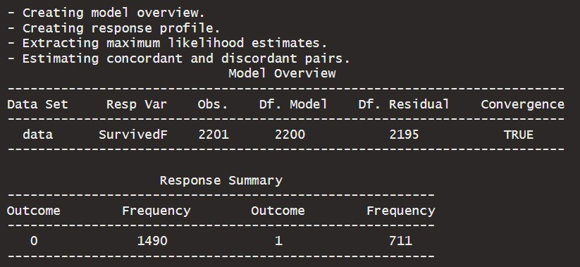
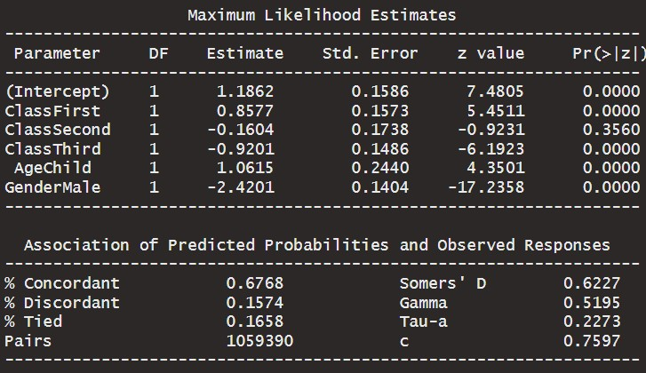
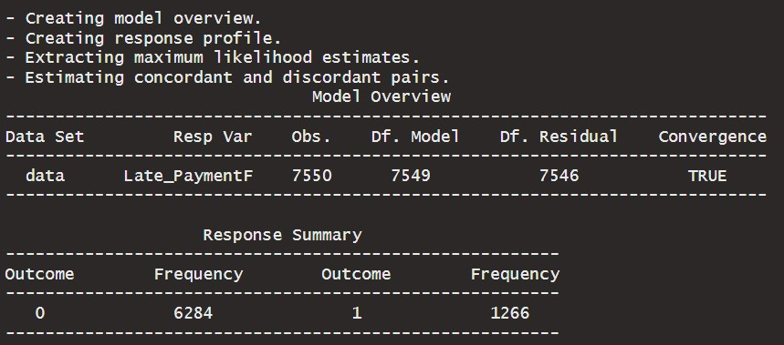
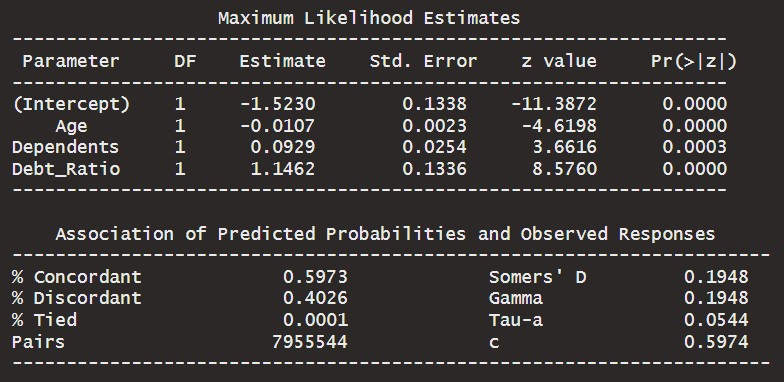

```{r setup, include=FALSE, echo=FALSE}
options(htmltools.dir.version = FALSE)
knitr::opts_chunk$set(
  fig.retina=2,
  #out.width = "75%",
  #out.height = "50%",
  htmltools.preserve.raw = FALSE,      # needed for windows
  scipen=100,                          # suppresses scientific notation
  getSymbols.warning4.0 = FALSE,       # suppresses getSymbols warnings
  cache = FALSE,
  echo = TRUE,
  hiline = TRUE,
  message = FALSE, 
  warning = FALSE
)


# install helper package (pacman)
# pacman loads and installs other packages, if needed
if (!require("pacman")) install.packages("pacman", repos = "http://lib.stat.cmu.edu/R/CRAN/")

# install and load required packages
# pacman should be first package in parentheses and then list others
pacman::p_load(pacman,tidyverse, magrittr, olsrr, gridExtra, ggiraphExtra, knitr, viridis)

# verify packages (comment out in finished documents)
p_loaded()


```

```{r xaringan-themer, include=FALSE, warning=FALSE}
library(xaringanthemer)

palette <- c(
  SU_Orange1        = "#F76900",
  SU_Orange2        = "#FF8E00",
  SU_Red_Orange     = "#FF431B",
  SU_Blue1          = "#000E54",
  SU_Blue2          = "#203299",
  SU_Light_Blue     = "#2B72D7",
  SU_White          = "#FFFFFF",
  SU_Light_Gray     = "#ADB3B8",
  SU_Medium_Gray    = "#707780",
  SU_Black          = "#000000", 
  
  steel_blue        = "#4682B4",
  corn_flower_blue  = "#6495ED",
  deep_sky_blue     = "#00BFFF",
  dark_magenta      = "#8B008B",
  medium_orchid     = "#BA55D3",
  lime_green        = "#32CD32",
  light_sea_green   = "#20B2AA",
  chartreuse        = "#7FFF00",
  orange_red        = "#FF4500",
  white_smoke       = "#F5F5F5",
  dark_cyan         = "#008B8B",
  light_steel_blue  = "#B0C4DE",
  indigo            = "#4B0082",
  ivory             = "#FFFFF0",
  light_slate_grey  = "#778899",
  linen             = "#FAF0E6",
  steel_blue        = "#4682B4",
  blue_violet       = "#8A2BE2",
  dodger_blue       = "#1E90FF",
  light_blue        = "#ADD8E6",
  azure             = "#F0FFFF",
  lavender          = "#E6E6FA")

primary_color = "#4682B4"                # steel_blue
secondary_color = "#778899"              # light_slate_grey
white_color = "#FFFFF0"                  # ivory
black_color = "#000080"                  # navy

style_duo_accent(
  primary_color = primary_color,
  secondary_color = secondary_color,
  white_color = white_color,
  black_color = black_color,
  text_color = black_color,
  header_color = primary_color,
  background_color = white_color,
  code_inline_background_color = "#E6E6FA", # lavender
  link_color = "#1E90FF",                   # dodger_blue
  code_inline_color = "#4B0082",            # indigo
  text_bold_color = "#8B008B",              # dark_magenta
  header_font_google = google_font("Open Sans"),
  text_font_google = google_font("Open Sans"),
  code_font_google = google_font("Source Code Pro"),
  colors = palette
)


```

```{r xaringan-panelset, echo=FALSE}
xaringanExtra::use_panelset()
```

```{r xaringan-tile-view, echo=FALSE}
xaringanExtra::use_tile_view()
```

```{r xaringan-fit-screen, echo=FALSE}
xaringanExtra::use_fit_screen()
```

```{r xaringan-tachyons, echo=FALSE}
xaringanExtra::use_tachyons()
```

```{r xaringan-animate-css, echo=FALSE}
xaringanExtra::use_animate_css()
```

```{r xaringan-animate-all, echo=FALSE}
#xaringanExtra::use_animate_all("slide_up")
```

background-image: url("docs_files/images/sloth_faded.png")
background-size: cover

class: bottom, right

## BUA 345 - Lecture 17

### Logistic Regression

<br>


#### Penelope Pooler Eisenbies

#### `r Sys.Date()`

[Wikipedia Sloth Page](https://en.wikipedia.org/wiki/Sloth)

---

### Upcoming Dates

.pull-left[

- **HW 7 was due on Monday, 3/20**. 

   - Grace Period is extended until Wednesday 3/22 at midnight, because of Spring Break.
   
- **HW 8 is now posted and is due Monday, 3/27**

  - Part 1 pertains to Lectures 15 and 16 
    
  - Part 2 pertains to Lecture 17 (today's lecture)
  
- **Quiz 2 is Thursday, March 30th**

  - Practice Questions will be posted by Friday (or Saturday)

]

.pull-right[

```{r owl pic, echo=FALSE, eval=F}

knitr::include_graphics("docs_files/images/owl.png")

```

]

---

### Getting Started with Markdown (Updated)

.pull-left[

- Download Zipped R project 

- Open Zipped folder and copy internal folder (R Project) to a BUA 345 folder on your computer NOT IN DOWLOADS

- **Open R Project:**
  
  - *OPTION 1:* Click on .Rproj file to open project and RStudio

  - *OPTION 2:* Open RStudio, then click File > Open Project > then navigate to  and click on .Rproj file.
  

- **Once Project is opened in RStudio:**

  - Click on `code_data_output` file to open it.

  - Click on `BUA_345_Lecture_17.Rmd` to open it.

  - Run `setup` Chunk


]

.pull-right[

```{r beaver pic, echo=FALSE, eval=F}

knitr::include_graphics("docs_files/images/beaver.png")

```

]

---

### Setup

.pull-left[

- The setup chunk shows the packages needed for this demo.   

- R will install specified packages if needed (only required once after R is installed)  

- R will load specified packaged (required every time you start a new R session)  

- The first time you run this code, R will install these packages which will be slow.  

- **If you get warnings, that's okay.**  

- If you get **error messages**, I (or TA), can help you.

]


.pull-right[

```{r owl pic2, echo=FALSE, eval=F}

knitr::include_graphics("docs_files/images/owl.png")

```

]


---

### Setup Chunk for Lecture 17

```{r setup for Lecture 17, include = T}

# this line specifies options for default options for all R Chunks
knitr::opts_chunk$set(echo=T, highlight=T)
# suppress scientific notation
options(scipen=100)

# install helper package that loads and installs other packages, if needed
if (!require("pacman")) install.packages("pacman", repos = "http://lib.stat.cmu.edu/R/CRAN/")

# install and load required packages
pacman::p_load(pacman,tidyverse, magrittr, olsrr, gridExtra, ggiraphExtra, knitr, viridis, blorr)

# verify packages
p_loaded()

```

**NOTES:

- ** NEW PACKAGE FOR LOGISTIC REGRESSION: `blorr`

- If you are having trouble installing/loading any packages, please come to office hour or make an appointment with me or course TA.

---

### Lecture 17 In-class Exercises

.pull-left[

#### **Question 1 (L17) - Session ID: bua345s23**

Review Question from Lecture 16 and HW 8.

In Lecture 16, we discussed three fit statistics, measures of how well the model 'fits' the data.
 
Fill in the blank(s) using the correct choice.
Ideally our chosen model has the 

- `____` Adjusted R<sup>2</sup>

- `____` Mallow's C(p)

- `____` AIC

]

.pull-right[

```{r beaver pic2, echo=FALSE, eval=F}

knitr::include_graphics("docs_files/images/beaver.png")

```

]


---

### Models we've covered so far

- Up until now in MAS 261 and BUA 345:

  - All of our regression models (SLR and MLR) have had a response, Y, that was ***QUANTITATIVE*** and ideally normal (or transformed to be normal):

    -   amount of sleep

    -   selling price

    -   natural log of insurance charges

    -   etc.
    
---

### How Logistic Regression is different

- Today we'll model responses (y variables) that are ***CATEGORICAL*** and ***BINARY***, such as

   - yes or no

   - survive or not

   - disease or no disease

- LOGISTIC REGRESSION is used when your response is BINARY (has two categories)

   - This is one type of generalization of the linear model format you've already learned.

   - There are MANY other model generalizations for other data types (not covered in BUA 345).

   - These models are called GENERALIZED LINEAR MODELS (GLM):

     - We are relaxing or the assumption that the response, Y is quantitative and normal.
    
---

### Logistic Regression Models

.pull-left[

- We can't model the dichotomous (two-category) response directly using the linear model.

- Instead, we **'LINK'** our binary response to our predictor variables using a link function.

- The underlying math is interesting, but not needed for this course.
]

.pull-right[

```{r yes_no, echo=FALSE, eval=F}

knitr::include_graphics("docs_files/images/yes_no.png")

```

]

---

### Probability and Odds

- In order to understand logistic regression models, it is helpful to know:

  - The differences between Probability and Odds

  - How to convert Probability to Odds and vise versa

  - How to convert Log Odds to probability using `exp` OR `plogis` function

- We cover these concepts FIRST, because:

  - Log Odds, LN(ODDS), is the link (link function)

  - This function LINKS our two categorical response, Y to our predictor (X) variables:

- If we understand this link, then we can understand and interpret Logistic Regression analyses.

---

### Probability and Odds are NOT the same!

-   Odds are often used incorrectly. For example:

#

-   This item indicates that the PROBABILITY of survival is 95.7%

-   Odds of Survival $≠$ Probability of Survival = P(Survival)

$$
Odds(Survival) = \frac{P(Survival)}{1-P(Survival)} = ?
$$

-   **Note: This question is in HW 8**

---


### Dice Example

.pull-left[


```{r dice demo, echo=F}

Outcome <- sample(1:6, 12000, replace=T)

ggplot()+
  geom_histogram(aes(x=Outcome), 
                 binwidth=1, 
                 color="darkblue", fill="lightblue") +
  theme_classic() +
  scale_x_continuous(breaks=seq(1,6,1)) +
  labs(y="Frequency", title="12000 Rolls of a Six-sided Die") +
  theme(plot.title = element_text(size=20),
        axis.title = element_text(size=18),
        axis.text = element_text(size=15),
        legend.text = element_text(size=10),
        plot.background = element_rect(colour = "darkgrey", fill=NA, linewidth=2))


```


]

.pull-right[

<br>

The probability of any side of the die is 1/6:

$$P(1) = P(2) = P(3) = P(4) = P(5) = P(6) = 1/6 $$

<br>

The Odds of any side, e.g. rolling a 2 is as follows:

$$
Odds(2) = \frac{P(2)}{1-P(2)} = 
\frac{\frac{1}{6}}{1-\frac{1}{6}} = 
\frac{\frac{1}{6}}{\frac{5}{6}} = \frac{1}{5}
$$

]

---

### Lecture 17 In-class Exercises

#### **Question 2 (L17) - Session ID: bua345s23**

The probability(p) of rolling a 3 or higher with a single die is 4/6 or 2/3, i.e., $P(3,4,5,6) = \frac{2}{3}$.

**What are the ODDS of rolling a 3 or higher?**

Hint: It is possible for odds to be greater than 1.

<br>

#### **Question 3 (L17)** 

If you flip a fair coin, the probability of heads = probability of tails = 1/2, i.e., $P(Heads) = P(Tails) = \frac{1}{2}$

**What are the odds of a coin landing on heads?**

---

### Odds and Betting

- Horse-racing and betting are where people commonly hear the term odds.

- For example, a horse in a race has 9 to 1 odds of winning.

- What is the probability this horse will win?

  - **How do we calculate probability from odds?**

$$
Probability = \frac{Odds}{1 + Odds}
$$

- **9 to 1 odds means Odds = $\frac{1}{9}$**

$$ 
P(Win) = \frac{\frac{1}{9}}{1 + \frac{1}{9}} = 
\frac{\frac{1}{9}}{\frac{10}{9}} =
\frac{1}{10} = 0.1
$$ 

**Conclusion:** A horse with 9 to 1 odds of winning has a 10% chance of winning the horse race.

---

### Lecture 17 In-class Exercises

#### **Question 4 (L17) - Session ID: bua345s23**

In Texas Hold'em, each player get's two face down cards in their 'pocket'. There are also three face up cards that everyone can use to make their best hand.

<br>

The odds of getting a 'Pocket Pair', a pair two cards of the same value in the face down cards is 16 to 1, i.e $Odds(Pocket Pair) = \frac{1}{16}$

<br>

**What is the probability of a pocket pair?** Round your answer to 3 decimal places

Recall:

$$
Probability = \frac{Odds}{1 + Odds}
$$

---

### Why Odds are useful to Logistic Regression

.pull-left[

- Probability is more intuitive

- Odds, and more specifically, ***LN(Odds)*** are the magic LINK between a binary response and our predictor variables.

- When we do Logistic Regression, the estimated response will be LN(Odds)

- Just like we back transform LN(Y) to get Y, we can convert LN(Odds) to probabilities.


]

.pull-right[

```{r owl pic3, echo=FALSE, eval=F}

knitr::include_graphics("docs_files/images/owl.png")

```

]


---

### Why back-transform Log-odds

**We DON'T want to know:**

  - the estimated log odds of winning a game
  - the estimated log odds that it will rain tomorrow

**We DO want to know:**

  - the estimated PROBABILITY of winning a game
  - the estimated PROBABILITY that it will rain tomorrow

So, we can convert the estimated log odds to a probability in Excel or R:

  -   Y' = Estimated Log Odds = Estimate of $LN(\frac{P}{1-P})$ from model

  -   Y' is the model estimate that we want to convert to a probability

  -   Est. Probability, $P = \frac{e^{Y'}}{1+e^{Y'}}$

  -   This can be calculated in Excel or R using the `exp` function:

  -   This conversion can be done more simply in R with the `plogis` function
  
---

### Example of Converting Log Odds

- A logistic regression model predicts the log odds that a small business owner will be audited by the IRS based on relevant predictor variables.

- Based on this model, a cafe in Syracuse determines that the estimated log odds of being audited in 2022 is -1.946, **Y' = -1.946**

#### Lecture 17 In-class Exercises

#### **Question 5 (L17) - Session ID: bua345s23**

If Estimated Log Odds = Y' = -1.946, what is the probability that this cafe will be audited?

Recall: Est. Probability, $P = \frac{e^{Y'}}{1+e^{Y'}}$

```{r convert log odds to probability}

# ln_odds <- 

# using exp function (same as excel)

# using plogis function (only in R)


```

---

### Logistic Regression in R

<br>

The following examples will show how logistic regression uses LN(Odds) as a link function to model a two category (binary) response.

- The model estimates, LN(Odds) can be converted to probabilities

- For HWs and quizzes and the final exam you will be expected to:

  - calculate odds from probabilities.

  - calculate probabilities from odds.

  - estimate probabilities from log odds estimates from a logistic regression model.

---

### Titanic data

.pull-left[

More complete version of Titanic passenger data than we worked with before.

All data are CATEGORICAL:

- Response, Y, is Survived: Yes or No

- Predictors, X variables, are:

   - Class (of Passenger ticket): First, Second, Third , Crew

   - Age (Category): Adult, Child

   - Gender: Male, Female

**What is the estimated probability of survival based on gender, age category, and passenger class?**
]

<br>

.pull-right[

```{r titanic image, echo=F, eval=F}


```


]

---

### Verifying Data for Logistic Regression

In order to use Logistic Regression the following conditions must be met:

- Each category of each predictor variable has more than **ONE** observation in each response category

- MOST categories have more than **FIVE** observations in each response category

```{r import and glimpse titanic data}

# import and examine data
titanic <- read_csv("titanic.csv", show_col_types = F) |>
  glimpse()

```

---

### Verifying Data for Logistic Regression

- These tables show that all categories of each predictor variable have some 'Yes' and some 'No' observations.
-   All categories are represented in both categories of response, so all predictors can be used in model.
```{r examine category counts in titanci data}
titanic |> select(Survived, Class) |> table()   # examine data by class category
titanic |> select(Survived, Age) |> table()     # examine data by age category
titanic |> select(Survived, Gender) |> table()  # examine data by gender

```

---

### Specifying the Logistic Regression Model:

The command we use in R, `glm` is used for Generalized Linear Models.

- For BUA 345, you are expected to interpret the coefficients from a logistic regression model.

  - Use provided code to get model estimates, LN(Odds)

  - Convert Estimated LN(Odds) to probabilities

  - In more advanced analytics courses, we will talk about model fit and validation.

**Steps Shown in Following Code**

**`1.`**  Create a `glm` model named `titanic_logistic`

- `family=binomial(link = 'logit')` specifies the model has a binary (two-category) response

**`2.`**  Output model results using `blr_regress` command from `blorr` package

- If this package doesn't work, an alternative command is `summary`

---

### R code to Specify and Summarize Titanic Model

```{r titanic model, results='hide'}
titanic <- titanic|> mutate(SurvivedF = factor(Survived))         # create factor variable

titanic_logistic <- glm(SurvivedF ~ Class + Age + Gender, data=titanic, # specify model
                        family=binomial(link = 'logit'))

blr_regress(titanic_logistic) # examine model output
# summary(titanic_logistic)   # alternative if bls_regress doesn't work

```

#### Part 1 of Output
```{r image1 of titanic output, echo=F}



```

---

### R code to Specify and Summarize Titanic Model

```{r titanic model2, eval=F}

blr_regress(titanic_logistic) # examine model output

```

#### Part 2 of Output
```{r image2 of titanic output, echo=F}



```

---

### Add Log Odds and Probabilities to Titanic Data

```{r add estimates to data}

titanic <- titanic |> # create a new variable that shows log odds of survival for each passenger
  mutate(Log_Odds_Survival = titanic_logistic |> glm(titanic, family = binomial) |>  predict.glm() |> round(4))
         
# convert log odds to probabilities using plogis command
titanic <- titanic |> mutate(Prob_Survival = Log_Odds_Survival |> plogis() |> round(4)) 

head(titanic) |> kable()

```


---

### Titanic Model Interpretation


We can use an Excel spreadsheet (like we did for MLR) to estimate **log odds** and **probabilities** for each category

- For example:

  - What is the probability that a Female Adult Crew member?

  - What is the probability that a Male Adult in Third Class?

  - What is the probability that a Male Child in First Class survived?

- Recall:

  - Baseline categories first alphabetically) are not shown.

  - Baseline Class: Crew

  - Baseline Age category: Adult

  - Baseline Gender = Female
  
---

### Lecture 17 In-class Exercises

#### **Question 6 (L17) - Session ID: bua345s23**

Based on the Titanic Logistic Regression Model, what is the probability that a Male Adult in Third Class survived?

Use provided worksheet to do calculation. Round answer to 3 decimal places.

<br>

#### **Question 7 (L17) - Session ID: bua345s23**

Based on the Titanic Logistic Regression Model, what is the probability that a Male Child in First Class survived?

Use provided worksheet to do calculation. Round answer to 3 decimal places.

---

### Two Plots for Context

-   The titanic data are commonly used because the differences between class and gender are so clear.
-   When looking at probabilities by category, it is also important to look at numbers of observations in each category.

```{r barplots for context, echo=F, fig.dim=c(15, 5), fig.align='center'}

# summarize and modify data for plot
titanic_plot <- titanic |>
  mutate(demog = paste(Gender, Age)) |>
  group_by(Class, demog, Survived) |>
  summarize(n=n()) |>
  pivot_wider(id_cols = c("Class", "Survived"), names_from = demog, values_from = n) |>
  pivot_longer(cols=`Female Adult`:`Male Child`, names_to = "demog", values_to = "n") |>
  mutate(demogF = factor(demog, levels = c("Female Child", "Male Child", 
                                           "Female Adult", "Male Adult")),
         ClassF = factor(Class, levels = c("Crew", "Third", "Second", "First")))
titanic_plot[is.na(titanic_plot)] <- 0

#barplot by class, age, gender, and survival
titanic_barplot1 <- titanic_plot |>
  ggplot() +
  geom_bar(aes(x=Survived, y=n, fill=demogF),
           stat="identity", position="dodge") +
  theme_classic() +
  facet_grid(~ClassF) +
  scale_fill_brewer(palette = "Set1") +
  labs(x = "", y = "Number of Passengers", fill = "", title = "Titanic Survival") +
  theme(plot.title = element_text(size=20),
        axis.title = element_text(size=18),
        axis.text = element_text(size=15),
        legend.text = element_text(size=10),
        legend.position = "bottom",
        plot.background = element_rect(colour = "darkgrey", fill=NA, linewidth=2))

#barplot by class, age, gender, and survival excluding adult males
titanic_barplot2 <- titanic_plot |> 
  filter(demog != "Male Adult") |>
  ggplot() +
  geom_bar(aes(x=Survived, y=n, fill=demogF),
           stat="identity", position="dodge") +
  theme_classic() +
  facet_grid(~ClassF) +
  scale_fill_brewer(palette = "Set1") +
  labs(x = "", y = "Number of Passengers", fill = "", title = "Titanic Survival (Excluding Adult Males)") +
  theme(plot.title = element_text(size=20),
        axis.title = element_text(size=18),
        axis.text = element_text(size=15),
        legend.text = element_text(size=10),
        legend.position = "bottom",
        plot.background = element_rect(colour = "darkgrey", fill=NA, linewidth=2))
  
grid.arrange(titanic_barplot1, titanic_barplot2, ncol=2)

```

---

### Late Payment Data

.pull-left[

#### Logistic Regression with Quantitative Predictors

- Data from the 7,550 consumers is used to create a logistic regression model

- The goal is to estimate the probability of late payment on a credit card

- Predictor (X) variables are:

  - Age
  - Number of Dependents
  - Debt ratio = Total Debt/Total Assets

]


.pull-right[

```{r past due graphic, echo=F}


```

]

---

### Logistic Regression with Quantitative Predictors

- All three variables are **QUANTITATIVE**

  - Correlation matrix indicates there is no multicollinearity
  
.pull-left[

```{r import and examine late payment data}

# import data and examine using glimpse
late_payment <- read_csv("LatePayment.csv", show_col_types = F) |>
  glimpse(width=40)

```


]

.pull-right[

```{r examine correlation matrix}

# examine correlation matrix
late_payment |> select(Age:Debt_Ratio) |>
  cor() |> round(2) |> kable()

```


]

---

### Steps to Specify and Summarize Late Payment

**`1.`** Create a `glm` model named `latepmt_logistic`
  
**`2.`** Output model results using `blr_regress` command from `blorr` package or `summary` command

```{r late payment model, results='hide'}
late_payment <- late_payment |> mutate(Late_PaymentF = factor(Late_Payment))  # create factor variable
latepmt_logistic <- glm(Late_PaymentF ~Age + Dependents + Debt_Ratio,         # specify model
                        data=late_payment, family=binomial(link = 'logit'))
blr_regress(latepmt_logistic) # examine model output
```

#### Part 1 of Output
```{r image1 of late payment output, echo=F}



```

---

### R code to Specify and Summarize Late Payment Model

```{r late payment2, eval=F}

blr_regress(titanic_logistic) # examine model output

```

#### Part 2 of Output
```{r image2 of late payment output, echo=F}



```

---

### Add Log Odds and Probabilities to Late Payment Data

```{r add estimates to late payment data}

late_payment <- late_payment |> # create a new variable that shows log odds of survival for each consumer
  mutate(Log_Odds_Late_Payment = latepmt_logistic |> glm(late_payment, family = binomial) |> predict.glm() |> round(4))
         
# convert log odds to probabilities using plogis command
late_payment <- late_payment |> mutate(Prob_Late_Payment = Log_Odds_Late_Payment |> plogis() |> round(4))

head(late_payment) |> kable()

```

---

### Late Payment Model Interpretation

We can use an Excel spreadsheet (like we did for MLR) to estimate **log odds** and **probabilities** for each category

- For example:

  - What is the probability of a late payment for a 30 year old with 1 dependent and a debt ratio of 0.3?

  - What would be the Percent Change in debt ratio if another 30 year old had 4 dependents and debt ratio of 0.5? (HW 8)

### Lecture 17 In-class Exercises

#### **Question 6 (L17) - Session ID: bua345s23**

What is the probability of a late payment for a 30 year old with 1 dependent and a debt ratio of 0.3?

Use provided worksheet to do calculation. Round answer to 3 decimal places.

<br>

### Now we're ready to examine HW 8 - Part 2

---

### Reminder Upcoming Dates

.pull-left[

- **HW 7 was due on Monday, 3/20**. 

   - Grace Period was extended until Wednesday 3/22 at midnight, because of Spring Break.
   
   - HW 7 can still be turned in today (Thu. 3/23), for only a 10% deduction 
   
- **HW 8 is due Monday, 3/27**

  - Part 1 pertains to Lectures 15 and 16 
    
  - Part 2 pertains to Lecture 17 (today's lecture)
  
- **Quiz 2 is Thursday, March 30th**

  - Practice Questions will be posted this weekend.

]

.pull-right[

```{r owl pic4, echo=FALSE, eval=F}

knitr::include_graphics("docs_files/images/owl.png")

```

]

---

background-image: url("docs_files/images/tired_panda_faded.png")
background-size: cover

.pull-left[

### Key Points from Today

.bg-azure.b--dark_cyan.ba.bw2.br3.shadow-5.ph2[

- Logistic Regression is useful for predicting outcomes

  - Helpful in decision making - provides probabilities

  - Underlying math of GLM is more complex

  - Software (such as R) allows students to bypass math and focus on interpretation

- Important to understand

  - Difference between Odds and Probabilities

  - How to convert odds to probabilities and vise versa

  - How to convert log odds to probabilities (you can use `plogis` function in R)
  
]

]

.pull-right[

.bg-azure.b--dark_cyan.ba.bw2.br3.shadow-5.ph3[
You may submit an 'Engagement Question' about each lecture until midnight on the day of the lecture. **A minimum of four submissions are required during the semester.**
]

]